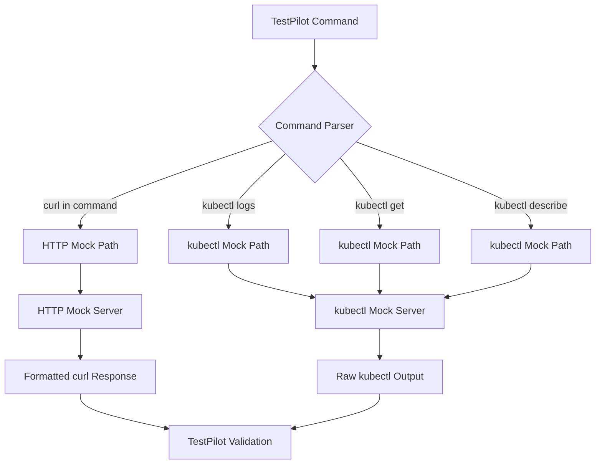

# Unified Mock Server for TestPilot
## Complete HTTP API and kubectl Command Mocking

The unified mock server extends TestPilot's mock capabilities to support **both HTTP API calls and kubectl commands** in a single, cohesive system.

## 🎯 **What's New**

### **Before: Limited HTTP-Only Mocking**
- ❌ Only `kubectl exec curl` commands were mockable
- ❌ Pure `kubectl logs` commands failed in mock mode
- ❌ `kubectl get`, `kubectl describe` commands unsupported
- ❌ Mixed test flows required production mode for kubectl parts

### **After: Unified Command Mocking**
- ✅ **HTTP API calls**: `kubectl exec curl` commands → Mock HTTP server
- ✅ **kubectl logs**: `kubectl logs pod` → Mock log entries
- ✅ **kubectl get**: `kubectl get pods` → Mock resource lists
- ✅ **kubectl describe**: `kubectl describe pod` → Mock resource details
- ✅ **Complete test flows** mockable end-to-end

## 🚀 **Quick Start**

### **1. Start Unified Mock Server**
```bash
# Start enhanced mock server with kubectl support
python3 enhanced_mock_server.py --port 8082 > mock_server.log 2>&1 &
```

### **2. Run TestPilot in Mock Mode**
```bash
# Now ALL commands work in mock mode!
python3 test_pilot.py -i tests.xlsx -m otp --execution-mode mock
```

### **3. Test Individual Commands**
```bash
# Test kubectl logs
python3 -c "
from mock_integration import MockExecutor
executor = MockExecutor('http://localhost:8082')
output, error, duration = executor.execute_mock_command(
    'kubectl logs my-pod -n namespace',
    'test-host', 'TestSheet', 'test_case_1'
)
print(output)
"

# Test kubectl get pods
python3 -c "
from mock_integration import MockExecutor
executor = MockExecutor('http://localhost:8082')
output, error, duration = executor.execute_mock_command(
    'kubectl get pods -n namespace',
    'test-host', 'TestSheet', 'test_case_1'
)
print(output)
"
```

## 🔧 **Architecture Overview**

### **Command Processing Flow**


### **Mock Server Endpoints**

#### **HTTP API Endpoints**
```
GET  /api/endpoint          → HTTP API mock responses
POST /api/endpoint          → HTTP API mock responses
PUT  /api/endpoint          → HTTP API mock responses
```

#### **kubectl Mock Endpoints**
```
GET  /mock/kubectl/logs     → kubectl logs mock output
GET  /mock/kubectl/get      → kubectl get mock output
GET  /mock/kubectl/describe → kubectl describe mock output
```

#### **Management Endpoints**
```
GET  /health               → Server health check
GET  /mock/sheets          → Available test sheets
GET  /mock/tests           → Available test cases
```

## 📋 **Supported kubectl Commands**

### **kubectl logs** ✅
```bash
# All of these work in mock mode:
kubectl logs pod-name -n namespace
kubectl logs {pod-pattern} -n namespace
oc logs pod-name -n namespace
```

**Mock Response:**
```json
{"level":"INFO","loggerName":"com.oracle.ocslf","message":"Mock log entry","timestamp":"2025-01-20T10:30:00.123Z"}
{"level":"DEBUG","loggerName":"com.oracle.ocslf.service","message":"Processing request","timestamp":"2025-01-20T10:30:00.456Z"}
```

### **kubectl get** ✅
```bash
# All of these work in mock mode:
kubectl get pods -n namespace
kubectl get services -n namespace
oc get deployments
```

**Mock Response:**
```
NAME                          READY   STATUS    RESTARTS   AGE
nudr-config-abc123-def456     1/1     Running   0          2d1h
appinfo-xyz789-mno345         1/1     Running   0          2d1h
slf-group-prov-qwe123-rty456  1/1     Running   0          2d1h
```

### **kubectl describe** ✅
```bash
# All of these work in mock mode:
kubectl describe pod pod-name -n namespace
kubectl describe service service-name
oc describe deployment deployment-name
```

**Mock Response:**
```
Name:         mock-pod-123
Namespace:    default
Status:       Running
IP:           10.244.1.100
Containers:
  mock-container:
    State:          Running
    Ready:          True
Events:           <none>
```

## 🎯 **Integration with TestPilot**

### **Existing HTTP API Testing** (unchanged)
```bash
# These continue to work exactly as before
kubectl exec pod -- curl -X GET http://api/endpoint
kubectl exec pod -- curl -X POST http://api/endpoint -d '{"data":"value"}'
```

### **New kubectl Command Testing** (now supported!)
```bash
# These now work in mock mode
kubectl logs nudr-config-{pod-id} -n ocnrfslf
kubectl get pods -n ocnrfslf
kubectl describe pod appinfo-{pod-id} -n ocnrfslf
```

### **Mixed Test Flows** (fully supported!)
```excel
Row 1: kubectl exec pod -- curl -X POST /api/create    → HTTP Mock
Row 2: kubectl logs application-pod -n namespace       → kubectl Mock
Row 3: kubectl get pods -n namespace                   → kubectl Mock
Row 4: kubectl exec pod -- curl -X GET /api/status     → HTTP Mock
```

## 🔍 **Command Detection Logic**

The unified mock system automatically detects command types:

```python
def parse_command(command: str) -> Tuple[str, Dict]:
    # HTTP commands (kubectl exec curl)
    if "curl" in command and ("kubectl exec" in command or "oc exec" in command):
        return "http", parse_kubectl_curl_command(command)

    # Pure kubectl commands
    elif command.startswith(("kubectl", "oc")):
        return "kubectl", parse_kubectl_command(command)

    # Unknown commands
    else:
        return "unknown", {}
```

## 🛠 **Configuration**

### **Default Mock Server URL**
```python
# Default setting (can be overridden)
mock_server_url = "http://localhost:8082"
```

### **Custom Mock Server**
```bash
python3 test_pilot.py -i tests.xlsx -m otp \
  --execution-mode mock \
  --mock-server-url http://custom-server:8080
```

### **Sheet and Test Context**
The mock server automatically receives context:
```python
headers = {
    "X-Test-Sheet": sheet_name,    # e.g., "oAuthValidation-igw"
    "X-Test-Name": test_name       # e.g., "test_oauth_validation_igw_1"
}
```

## 🧪 **Testing and Validation**

### **Test the Mock Parser**
```bash
python3 test_unified_mock.py
```

### **Manual Testing**
```bash
# Test kubectl logs endpoint
curl "http://localhost:8082/mock/kubectl/logs?sheet=TestSheet&test=test1&pod_pattern=my-pod&namespace=default"

# Test kubectl get endpoint
curl "http://localhost:8082/mock/kubectl/get?sheet=TestSheet&test=test1&resource_type=pods&namespace=default"

# Test HTTP endpoint (existing)
curl -X GET "http://localhost:8082/api/test" -H "X-Test-Sheet: TestSheet" -H "X-Test-Name: test1"
```

### **Health Check**
```bash
curl http://localhost:8082/health
```

## 📊 **Benefits**

### **Complete Test Isolation** 🏝️
- ✅ No dependency on live Kubernetes clusters
- ✅ No dependency on live application services
- ✅ Consistent, repeatable test results
- ✅ Fast test execution (no network delays)

### **Comprehensive Coverage** 📈
- ✅ HTTP API testing (existing functionality)
- ✅ kubectl logs validation (new!)
- ✅ kubectl resource queries (new!)
- ✅ End-to-end test flow mocking (new!)

### **Developer Experience** 👨‍💻
- ✅ Single command to run all tests in mock mode
- ✅ No environment setup required
- ✅ Debug with mock server logs
- ✅ Same validation logic as production

## 🚦 **Migration Guide**

### **No Changes Required!** ✅
Existing TestPilot tests work unchanged:

```bash
# This continues to work exactly as before
python3 test_pilot.py -i tests.xlsx -m otp --execution-mode mock
```

### **New Capabilities Available** 🚀
kubectl commands that previously failed now work:

```bash
# Before: ❌ These failed in mock mode
# After:  ✅ These work in mock mode
kubectl logs my-pod -n namespace
kubectl get pods -n namespace
kubectl describe pod my-pod
```

## 🔧 **Advanced Usage**

### **Custom kubectl Responses**
To customize kubectl mock responses, extend the enhanced mock server:

```python
def generate_kubectl_mock_data(self, kubectl_type, namespace, pod_pattern, resource_type, resource_name):
    if kubectl_type == "logs":
        # Return custom log entries based on your test data
        return custom_log_entries_for_test(namespace, pod_pattern)
    # ... etc
```

### **Test-Specific Responses**
The mock server receives sheet and test context, allowing test-specific responses:

```python
def find_kubectl_response(self, kubectl_type, sheet, test, ...):
    # Look up test-specific kubectl responses
    if sheet == "LogValidationTests" and test == "test_error_logs":
        return error_log_entries()
    elif sheet == "PodTests" and test == "test_pod_scaling":
        return scaled_pod_list()
    # ... etc
```

## 🎉 **Summary**

The unified mock server transforms TestPilot from an **HTTP-only mock system** into a **comprehensive Kubernetes testing platform** that mocks:

- ✅ **HTTP API calls** via kubectl exec curl
- ✅ **kubectl logs** for log validation testing
- ✅ **kubectl get** for resource state verification
- ✅ **kubectl describe** for detailed resource inspection

**Result:** Complete test flows can now run in mock mode, providing faster, more reliable, and fully isolated testing! 🚀
